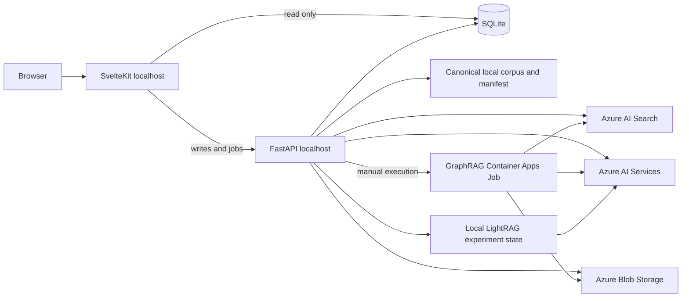

# Retrieve Architecture

## Product boundary

Retrieve is a local-first, eval-driven architecture selection accelerator. It ingests a corpus, generates a curated golden set, provisions candidate retrieval dependencies, indexes each candidate, evaluates them with the same questions, compares quality/latency/cost, keeps the winner, and removes experiment artifacts that are no longer needed.

It is not a hosted RAG application or conversation framework.

## Runtime topology

SvelteKit and FastAPI are not deployed by the current azd contract. Azure contains experiment dependencies and remote GraphRAG compute only.

## Ownership

| Boundary | Owner |
|---|---|
| Browser routes and local reads | SvelteKit |
| Operational writes and long-running jobs | FastAPI |
| Durable workflow, eval, architecture, and event state | SQLite |
| Corpus identity and exact file set | Canonical manifest |
| ARM resources, identity, RBAC, diagnostics | Root modular Bicep |
| Environment orchestration and outputs | azd |
| Region/capacity assessment and fallback | `retrieve.provision.azd` |
| Image publication and corpus synchronization | Thin postprovision hook |

## State contracts

- FastAPI is the sole writer for operational SQLite/config state. SvelteKit proxies mutations.
- SQLite uses WAL, schema-version rejection, durable operation jobs, idempotency, admission locking, and bounded event replay.
- Corpus generations are immutable sets identified by a SHA-256 fingerprint. Blob synchronization is manifest-owned and requires an exact dry-run plan before deletion.
- GraphRAG writes immutable `runs/<fingerprint>/<job-id>` artifacts. An architecture becomes active only when the Azure execution and durable Blob status both succeed.
- GraphRAG and LightRAG return canonical manifest document IDs; generated answer text is never treated as retrieval evidence.

## Azure topology

One resource group per unique azd environment contains:

- Log Analytics and Application Insights
- User-assigned managed identity
- Azure Container Registry
- Storage containers for corpus and GraphRAG artifacts
- Azure AI Services with pinned chat and embedding deployments
- Azure AI Search
- Container Apps managed environment
- One manual GraphRAG Container Apps Job

Local/shared-key authentication is disabled where supported. Runtime and Search identities receive resource-scoped data-plane roles.

## Capacity model

Preflight distinguishes authorization/policy, regional offering, quota, and backend capacity. Search quota and exact model-capacity APIs are checked before ARM preview. A deployment-time backend-capacity failure triggers bounded whole-stack regional fallback only after the isolated failed attempt is purged. Quota, authorization, policy, and template failures are not blindly retried.

See [Azure capacity model](docs/reference/azure-capacity-model.md) and [Azure lifecycle operations](docs/operations/azure-lifecycle.md).
