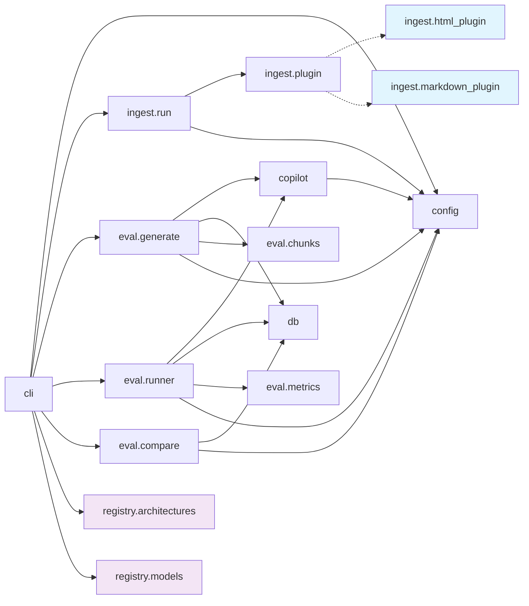
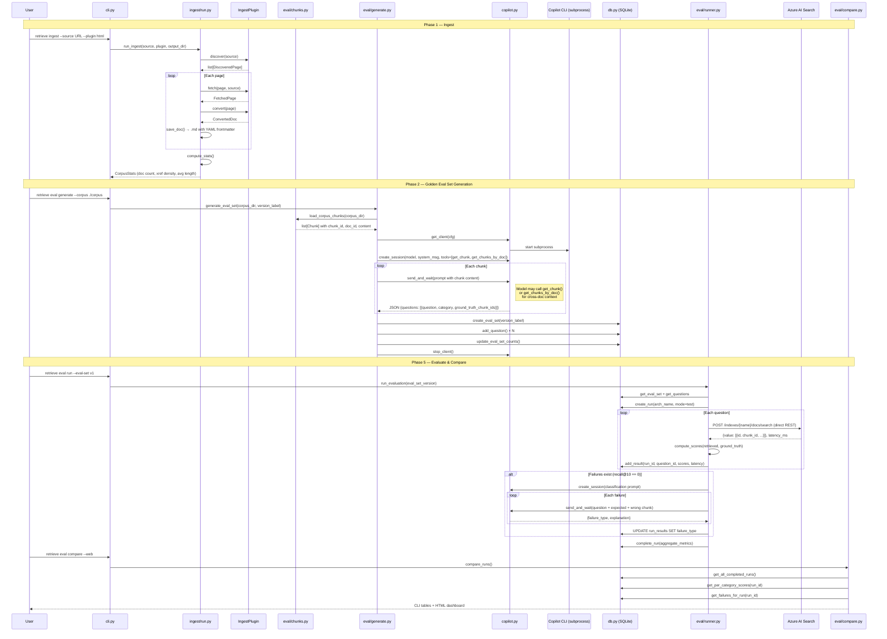
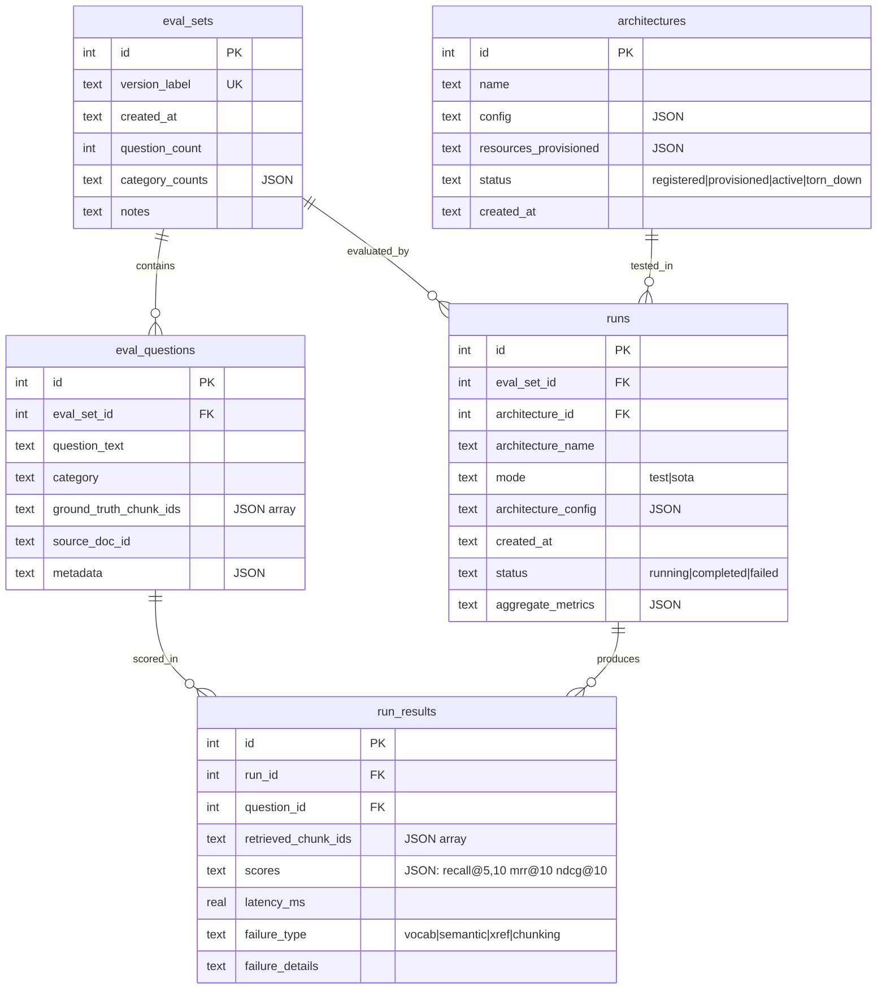
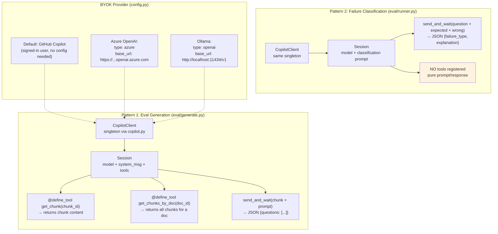
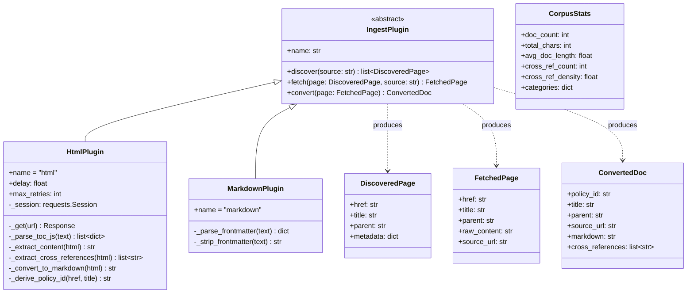
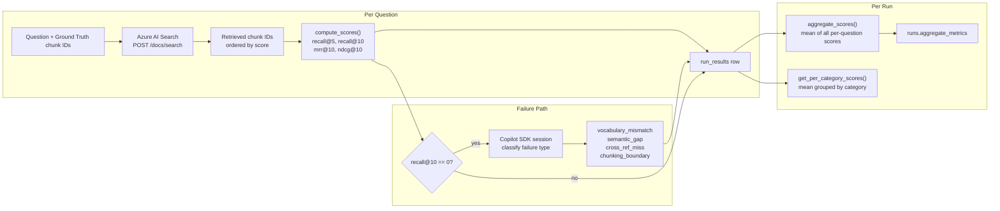
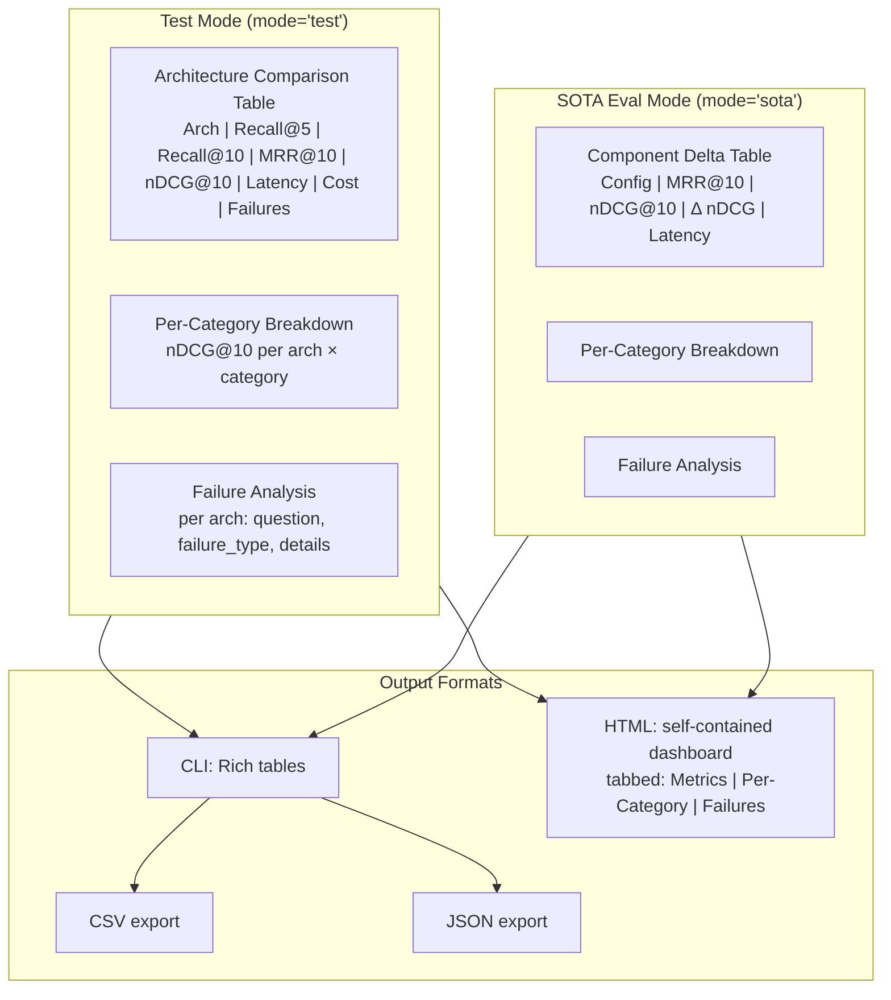

# Retrieve — Architecture Design

> Source of truth for how the system is structured, what calls what,
> and how data flows through the pipeline.
>
> Vision: [Retrieve.md](../docs/vision/Retrieve.md)
> Build plan: [TODO.md](../docs/vision/TODO.md)

---

## System Overview

```mermaid
graph TB
    subgraph UI["Web UI — Primary Interface (web/app.py)"]
        ui_home[Home / Status]
        ui_ingest[Ingest View]
        ui_eval[Eval Set View<br/>Generate + Curate]
        ui_run[Run View<br/>Live Progress via SSE]
        ui_compare[Compare Dashboard<br/>Test Mode + SOTA Mode]
        ui_provision[Provision View]
        ui_history[History / Iteration Timeline]
    end

    subgraph CLI["CLI Layer (cli.py) — Automation Interface"]
        ingest_cmd[retrieve ingest]
        eval_gen[retrieve eval generate]
        eval_run[retrieve eval run]
        eval_cmp[retrieve eval compare]
        info_cmd[retrieve info]
        provision_cmd[retrieve provision]
        index_cmd[retrieve index]
        teardown_cmd[retrieve teardown]
    end

    subgraph Core["Core Services"]
        config[config.py<br/>YAML → RetrieveConfig]
        copilot[copilot.py<br/>Copilot SDK Client]
        db[db.py<br/>SQLite Data Layer]
    end

    subgraph Ingest["Ingestion (ingest/)"]
        plugin[plugin.py<br/>IngestPlugin ABC]
        html[html_plugin.py<br/>RoboHelp → Markdown]
        md[markdown_plugin.py<br/>Passthrough]
        run_ingest[run.py<br/>Orchestrator + Stats]
    end

    subgraph Eval["Evaluation (eval/)"]
        chunks[chunks.py<br/>Corpus → Chunks]
        generate[generate.py<br/>Question Generation]
        metrics[metrics.py<br/>Recall, MRR, nDCG]
        runner[runner.py<br/>Search + Score]
        compare[compare.py<br/>Dashboard + Export]
    end

    subgraph Registry["Registries (registry/)"]
        arch_reg[architectures.py<br/>9 Architectures]
        model_reg[models.py<br/>Embeddings + Rerankers]
    end

    subgraph External["External Systems"]
        copilot_cli[GitHub Copilot CLI<br/>subprocess]
        ai_search[Azure AI Search<br/>REST API]
        azure_res[Azure Resources<br/>Bicep / IaC]
    end

    %% UI → same core modules as CLI (no logic duplication)
    ui_ingest --> run_ingest
    ui_eval --> generate
    ui_run --> runner
    ui_compare --> compare
    ui_home --> db
    ui_history --> db
    ui_provision -.-> azure_res

    %% CLI → Core
    ingest_cmd --> config
    eval_gen --> config
    eval_run --> config
    eval_cmp --> config
    info_cmd --> arch_reg & model_reg

    %% CLI → Modules
    ingest_cmd --> run_ingest
    eval_gen --> generate
    eval_run --> runner
    eval_cmp --> compare

    %% Core dependencies
    copilot --> copilot_cli
    generate --> copilot
    runner --> copilot
    generate --> db
    runner --> db
    compare --> db
    run_ingest --> plugin

    %% Plugin implementations
    plugin -.-> html
    plugin -.-> md

    %% External calls
    runner --> ai_search
    generate --> chunks

    %% Provision (not built)
    provision_cmd -.-> azure_res
    index_cmd -.-> ai_search

    style provision_cmd stroke-dasharray: 5 5
    style index_cmd stroke-dasharray: 5 5
    style teardown_cmd stroke-dasharray: 5 5
    style azure_res stroke-dasharray: 5 5
    style ui_home stroke-dasharray: 5 5
    style ui_ingest stroke-dasharray: 5 5
    style ui_eval stroke-dasharray: 5 5
    style ui_run stroke-dasharray: 5 5
    style ui_compare stroke-dasharray: 5 5
    style ui_provision stroke-dasharray: 5 5
    style ui_history stroke-dasharray: 5 5
```



> **Key design principle:** The Web UI and CLI call the same core Python functions.
> No logic lives in either interface layer — they are thin wrappers over `ingest/run.py`,
> `eval/generate.py`, `eval/runner.py`, `eval/compare.py`, and `db.py`.
> Build order: core modules first (via CLI), then wrap in UI as the final step.

---

## Module Dependency Graph

Shows which modules import from which — no circular dependencies allowed.



---

## Data Flow: End-to-End Pipeline



---

## SQLite Schema (Entity Relationship)



---

## Copilot SDK Integration Model

Two distinct usage patterns — never mixed:



---

## Ingestion Plugin Architecture



---

## Evaluation Metrics Pipeline



---

## Dashboard Output Model

Two views, determined by `run.mode`:



---

## Config → Session Mapping

How `retrieve.yaml` fields translate to Copilot SDK calls:

```
retrieve.yaml                    SDK Call
─────────────                    ────────
copilot:
  model: gpt-4.1         →      create_session({ model: "gpt-4.1" })
  timeout: 120            →      send_and_wait(timeout=120)
  github_token: ghp_...  →      SubprocessConfig(github_token=...)
  provider:               →      create_session({ provider: {
    type: azure                    type: "azure",
    base_url: https://...          base_url: "https://...",
    api_key: $KEY                  api_key: "...",
    azure:                         azure: { api_version: "2024-10-21" }
      api_version: ...           }})
```

---

## What's Built vs Planned

## Search Schema Guardrails

- Large text body fields in Azure AI Search must stay searchable-only unless they are chunked or projected into smaller units.
- Setting `filterable`, `facetable`, or `sortable` on long text can force whole-field term indexing and hit the 32 KB (`32766` byte UTF-8) term limit.
- If field-level schema controls are added later, the config/UI layer should reject unsafe combinations for body fields or automatically route them through chunking/projection logic.

| Component | Status | Module |
|---|---|---|
| CLI entrypoint (all commands) | ✅ Built | `cli.py` |
| Config system (YAML + BYOK) | ✅ Built | `config.py` |
| Copilot SDK client | ✅ Built | `copilot.py` |
| SQLite data layer | ✅ Built | `db.py` |
| HTML ingestion | ✅ Built | `ingest/html_plugin.py` |
| Markdown ingestion | ✅ Built | `ingest/markdown_plugin.py` |
| Ingestion orchestrator + stats | ✅ Built | `ingest/run.py` |
| Corpus chunking | ✅ Built | `eval/chunks.py` |
| Eval generation (Copilot SDK) | ✅ Built | `eval/generate.py` |
| Eval curation (category steering) | ✅ Built | `eval/curate.py` |
| Retrieval metrics | ✅ Built | `eval/metrics.py` |
| Eval runner + failure classification | ✅ Built | `eval/runner.py` |
| Comparison dashboard (CLI + HTML) | ✅ Built | `eval/compare.py` |
| Architecture registry (9 archs) | ✅ Built | `registry/architectures.py` |
| Model registry (4 embed + 4 rerank) | ✅ Built | `registry/models.py` |
| SOTA path registry (4 paths) | ✅ Built | `registry/sota_paths.py` |
| Azure provisioning (Bicep + orchestrator) | ✅ Built | `provision/` |
| Corpus indexing (blob + search) | ✅ Built | `indexing/` |
| Teardown (search resource deletion) | ✅ Built | `provision/teardown.py` |
| Web UI — FastAPI + REST API | ✅ Built | `web/app.py` |
| Tests (222 passing, 88% coverage) | ✅ Built | `tests/` |
| PDF ingestion plugin | ⬜ Not built | — |
| Streaming progress (SSE) | ⬜ Not built | — |
| Deduplication | ⬜ Not built | — |
| Cost estimation | ⬜ Not built | — |
| Cosmos/Functions Bicep (GraphRAG) | ⬜ Not built | — |
| Multi-vector/agentic/GraphRAG/LightRAG indexers | ⬜ Not built | — |
| Hooks / OTel | ⬜ Not built | — |
| Web UI pages: Ingest, Provision, Run, Teardown | ⬜ Not built | — |
| Curation UI (within web UI) | ⬜ Not built | — |
| Teardown | ⬜ Not built | — |
| Hooks / OTel | ⬜ Not built | — |
| SOTA path registry | ⬜ Not built | — |
